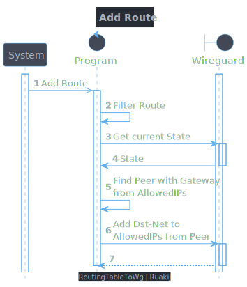
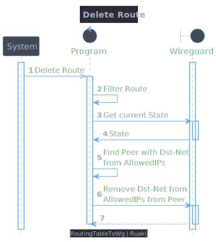

RoutingTableToWG
--

Translate Routing-Table Entries to Wireguard AllowedIPs with Filters

<br>

<!-- TOC -->
- [1. Overview](#1-overview)
  - [1.1. Usage](#11-usage)
  - [1.2. Install](#12-install)
- [2. Behaviour](#2-behaviour)
  - [2.1. Adding Route](#21-adding-route)
  - [2.2. Deleting Route](#22-deleting-route)
<!-- /TOC -->

<br>

# 1. Overview 

## 1.1. Usage

The Program will listen for RoutingTable Changes and can translate the changes to a Wireguard-Interface.

It will detect the Peer to add the Route to using the Gateway from the Route-Entry.<br>
In case routes clash or cant be added to Wireguard, Warnings will be logged.

<br>

### 1.1.1. Examples

- Dynamic Routing with Routing-Protocols (e.g. OSPF)
- Interacting with Wireguard using the familiar Tools like `iproute2`

<br>

## 1.2. Install

### 1.2.1. Environment

Variable|Description|Type|Default
-|-|-|-
`INTERFACE`*      | Wireguard-Interface Name | String       |
`FILTER_PROTOCOL` | Protocol to react on | Number / iproute2-name  | All
`FILTER_TABLE`    | Table to react on | Number / iproute2-name  | All
`PERIODIC_SYNC`   | Reguarly sync the routing-table <br> Useful when the wg-interface is changed/updated without us knowing  | Seconds  | -1

*\* Required*

<br>

### 1.2.2. Docker

Depending on the needs, the Container can be run in `network_mode: host` to be able to access routing-tables and interfaces of the host.

Additionally the capability `NET_ADMIN` is required for interacting with interfaces.

<details><summary><code>docker-compose.yml</code></summary>

```yaml
version: '3'

services:
  routingtabletowg:
    image: ruakij/routingtabletowg
    restart: unless-stopped
    network_mode: host
    cap_add:
      - NET_ADMIN
    environment:
      - INTERFACE="<wgInterfaceName or empty for wg0>"
```
</details>

<br>

### 1.2.3. Without Docker

Clone the Repository `git clone <URI>` and build the Program with `go build cmd/app`

Then you can run it with `./app`

<br>

# 2. Behaviour

## 2.1. Adding Route



<br>

## 2.2. Deleting Route


